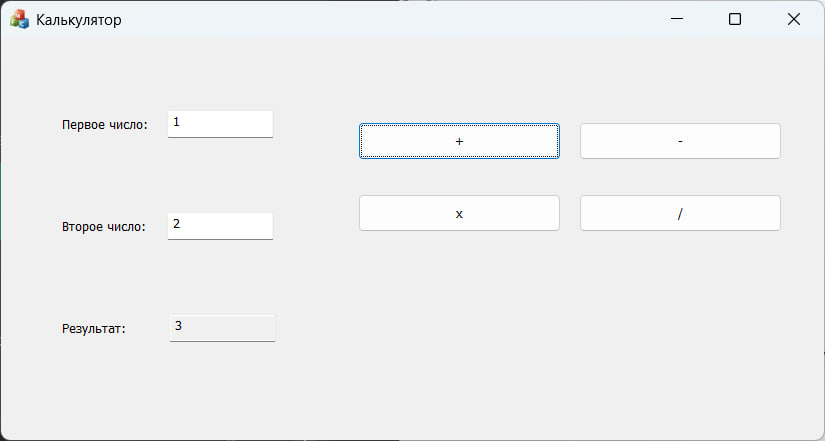

# MFC Calculator

Простой и удобный калькулятор, разработанный с использованием Microsoft Foundation Classes (MFC). Приложение предоставляет графический интерфейс для выполнения базовых арифметических операций.

---

## 📸 Скриншоты

---

## ✨ Функциональность

- **Базовые арифметические операции:**
  - Сложение (+)
  - Вычитание (-)
  - Умножение (×)
  - Деление (÷)

- **Валидация данных:**
  - Защита от деления на ноль
  - Визуальное и звуковое оповещение об ошибках

- **Пользовательский интерфейс:**
  - Интуитивно понятное управление
  - Поля ввода для двух операндов
  - Поле для отображения результата
  - Кнопки для выбора операции

---

## 🛠️ Сборка и запуск

### Требования
- Microsoft Visual Studio 2019 или новее
- Поддержка C++ и MFC

### Инструкция по сборке
1. Откройте файл решения `MFC_NUM2.sln` в Visual Studio
2. Выберите конфигурацию сборки (Debug/Release)
3. Соберите решение через меню `Build → Build Solution`
4. Запустите приложение через `Debug → Start Without Debugging`

---

## 🖱️ Использование

1. **Ввод данных:**
   - Введите первое число в поле "Edit1"
   - Введите второе число в поле "Edit2"

2. **Выбор операции:**
   - Нажмите одну из четырех кнопок:
     - `ADD` - для сложения
     - `SUB` - для вычитания
     - `MULTI` - для умножения
     - `DIV` - для деления

3. **Просмотр результата:**
   - Результат операции отобразится в поле "EDIT_RES"

4. **Обработка ошибок:**
   - При делении на ноль программа:
     - Издаст звуковой сигнал
     - Покажет сообщение об ошибке
     - Не выполнит операцию деления

---

## 🔧 Технические детали

### Основные классы
- **CMFCNUM2App:** Основной класс приложения
- **CMFCNUM2Dlg:** Главное диалоговое окно калькулятора
- **CAboutDlg:** Диалог "О программе"

### Механизм данных
- Используется механизм DDX/DDV MFC для связывания данных
- Переменные-члены:
  - `m_1` - первый операнд (double)
  - `m_2` - второй операнд (double)
  - `m_3` - результат (double)

### Обработчики событий
- `OnBnClickedAddButton()` - обработчик сложения
- `OnBnClickedSubButton()` - обработчик вычитания
- `OnBnClickedMultiButton()` - обработчик умножения
- `OnBnClickedDivButton()` - обработчик деления с проверкой на ноль

---

## 📝 Примечания

- Проект создан в учебных целях для демонстрации работы с MFC
- Для работы с дробными числами используются переменные типа double
- Реализована базовая обработка ошибок ввода

---

## 👤 Автор

**Лида Липатова**
- GitHub: [@lidalipa](https://github.com/lidalipa)
- Tg: [@lida_lipa](https://t.me/lida_lipa)

